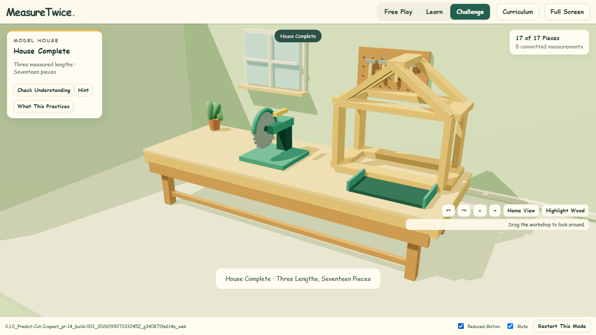
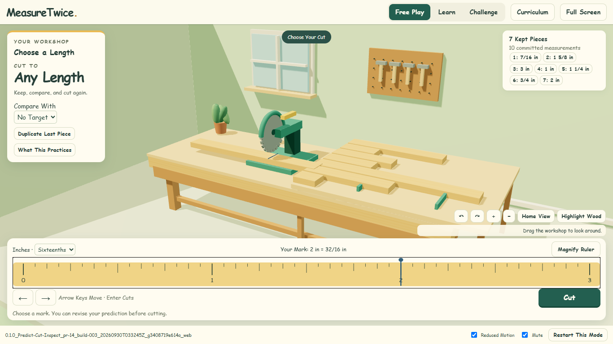

# PR 14 Integrated Review Evidence

- [Download the Playable ZIP](./0.1.0_Predict-Cut-Inspect_pr-14_build-003_20260930T033245Z_g3408719e614a_web.zip?raw=true)
- [View the Completed House](./0.1.0_Predict-Cut-Inspect_pr-14_build-003_20260930T033245Z_g3408719e614a_web_House.png)
- [View the Free Play Comparison](./0.1.0_Predict-Cut-Inspect_pr-14_build-003_20260930T033245Z_g3408719e614a_web_Free-Play-Comparison.png)

## Immutable Build

`0.1.0_Predict-Cut-Inspect_pr-14_build-003_20260930T033245Z_g3408719e614a_web`

- Built UTC: `2026-09-30T03:32:45.830Z`.
- Built from clean source [`3408719e614a0531eee21135b562462dbf824a5f`](https://github.com/AbbyUsesAIThatCodes/MeasureTwice/commit/3408719e614a0531eee21135b562462dbf824a5f).
- The ZIP and screenshots are unchanged copies of the tested build. This later evidence commit does not rebuild or relabel it; the built-source SHA remains the one above.
- [Machine-Readable Artifact Manifest](./artifact-manifest.json) records exact filenames, sizes and SHA-256 hashes.

## Quick Test

1. Download and extract the ZIP. With Node.js installed, open the enclosed `Start Review.cmd` on Windows. Alternatively, run `node serve.mjs . 18443` from its build folder, then visit `http://127.0.0.1:18443`. Stop another review server on that port first.
2. Confirm the complete build ID in the footer. The game runs locally with its included Three.js dependency; there is no production deployment.
3. Challenge: cut 1 1/8 in for the first 1 1/4-in target. The saw cuts and camera travels before held feedback. Keep correct cuts of 1 1/4, 2 and 1 in to assemble the 17-piece house from three normalized lengths.
4. Free Play: retain different lengths and make equal copies. Learn: choose any of five lessons. Challenge: open Check Understanding for six checks.
5. In C03, the pre-cut target is 6/8 in. Learn lesson 3 or a Hint marks later C03 cut/objective/explanation records assisted. Inspect a house cut and Restart: the original response and exposure history remain.

See the [Complete Review Checklist](https://github.com/AbbyUsesAIThatCodes/MeasureTwice/blob/3408719e614a0531eee21135b562462dbf824a5f/docs/REVIEW_CHECKLIST.md) and [Source Verification](https://github.com/AbbyUsesAIThatCodes/MeasureTwice/blob/3408719e614a0531eee21135b562462dbf824a5f/docs/PRIMARY_SOURCE_VERIFICATION.md) at the built revision.

## Verification And Limits

This exact artifact passed 12 unit tests, exact-house geometry, and real Chrome WebGL workshop/learning/access/assessment checks. Those include the held inspection sequence, 17 unscaled house pieces, all five lessons and six checks, seven separated comparison pieces, magnified keyboard navigation, assistance history across guidance/hints/navigation/Restart, and unchanged first responses. No browser errors or external runtime requests occurred.

This remains a teacher review build. Detailed lesson animations, fresh independent variants and classroom/physical-ruler transfer remain pending. No mastery or classroom-release claim is made. Page reload clears local session records. No private course PDFs, student records or proprietary course archive are included.

The earlier Library helper attempt failed before any upload; no Library identity was assigned and no direct fallback was used. These GitHub copies fulfill the separately authorized PR artifact backup. Existing PR12/PR13 snapshots and launchers remain preserved. No release, workflow, merge, auto-merge, Pages change or deployment accompanies this evidence.

## File Integrity

| Filename | Bytes | SHA-256 |
| --- | ---: | --- |
| `0.1.0_Predict-Cut-Inspect_pr-14_build-003_20260930T033245Z_g3408719e614a_web.zip` | 514138 | `3634697cb768b1f1d8c0db7cecc8344392d19f59a50110d69fb4b10989e372d8` |
| `0.1.0_Predict-Cut-Inspect_pr-14_build-003_20260930T033245Z_g3408719e614a_web_House.png` | 183645 | `049b2abe44e8cb093e584e4e6411d6d9915ecbe90df1f2b9832c37db84626144` |
| `0.1.0_Predict-Cut-Inspect_pr-14_build-003_20260930T033245Z_g3408719e614a_web_Free-Play-Comparison.png` | 177888 | `8c567623682236e6b3ef442b65bb2e8263c45443d984b93e0f901a9f6e9dea99` |

## Screenshots

