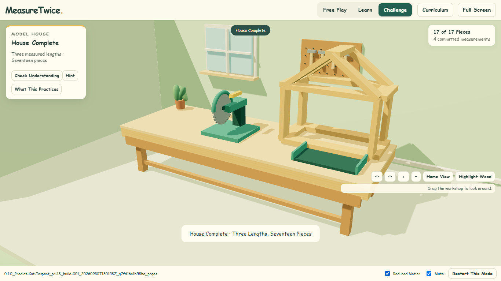

# PR 18 Pages Review

[Download the Playable ZIP](./0.1.0_Predict-Cut-Inspect_pr-18_build-001_20260930T130158Z_g7fd16c1b58be_pages.zip?raw=true) · [View the Screenshot](./0.1.0_Predict-Cut-Inspect_pr-18_build-001_20260930T130158Z_g7fd16c1b58be_pages_House.png) · [Browser Evidence](./pages-verification.json) · [Hashes and Manifest](./artifact-manifest.json)

## Exact Snapshot

`0.1.0_Predict-Cut-Inspect_pr-18_build-001_20260930T130158Z_g7fd16c1b58be_pages`

Clean built source: `7fd16c1b58be3868cfc2c804df2813ebf2e3a38a`; UTC `2026-09-30T13:01:58.311Z`. The later evidence commit only preserves this artifact. It does not rebuild or relabel it. Production will have its own main-run/attempt identity after the owner starts deployment.

## Quick Review

Download and extract the ZIP. Run `Start Pages Review.cmd` on Windows with Node installed, or run `node serve.mjs . 18447` from its enclosing build folder. Open `http://127.0.0.1:18447/MeasureTwice/`. Stop another server on that port first. The nested `MeasureTwice/` directory is the exact production upload payload; the launcher and server remain outside it.

Check the full footer ID, cut a wrong length and inspect it, then accept 1 1/4, 2 and 1 in to assemble 17 pieces. Open Curriculum → Content Index and confirm its URL stays under /MeasureTwice/. Free Play, Learn and C03 are unchanged.

## Verified And Pending

15 model/content/identity tests and exact-house geometry passed. Workflow YAML was parsed and checked for main-only triggers, pinned official actions, permissions, matching artifact-name flow, one artifact/one-day retention and disabled automatic Pages enablement. Pinned pnpm10.17.1 completed the frozen install. Static output contains 31 allowlisted files. Real Chrome WebGL at /MeasureTwice/ passed identity, relative module/data paths, wrong-cut inspection, the 17-piece house, C03's 6/8 prompt, Curriculum link and Learn/Free Play. No page errors or bad/external requests. No gameplay/UI or old local-builder changes.

GitHub Actions execution and the actual public URL await the owner. No workflow was dispatched and no Pages settings, billing, release or deployment were changed. [Owner Setup and Merge Behavior](../../docs/PAGES.md): after merge choose Settings → Pages → Build and deployment → Source → GitHub Actions, then run Deploy MeasureTwice Pages on main when ready. The merge queues the workflow and initially fails configuration if Pages is disabled. After setup, relevant later main merges/pushes deploy automatically; PRs do not run it.

| File | Bytes | SHA-256 |
| --- | ---: | --- |
| `0.1.0_Predict-Cut-Inspect_pr-18_build-001_20260930T130158Z_g7fd16c1b58be_pages.zip` | 518829 | `c7cede5541786e48740ef11cdbadc8e407787eb64b17bb8dd3c79bb21262343e` |
| `0.1.0_Predict-Cut-Inspect_pr-18_build-001_20260930T130158Z_g7fd16c1b58be_pages_House.png` | 183545 | `b15527c90377178e7700a7ddfb92d9ff9de662145609c9d78859bb749933cf18` |

