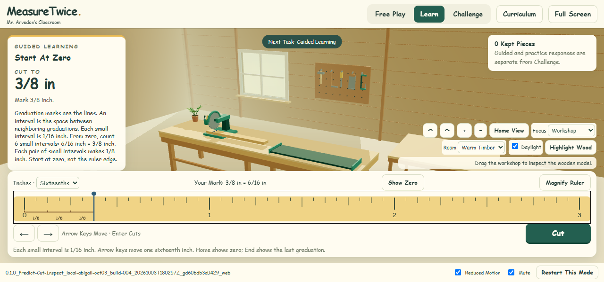
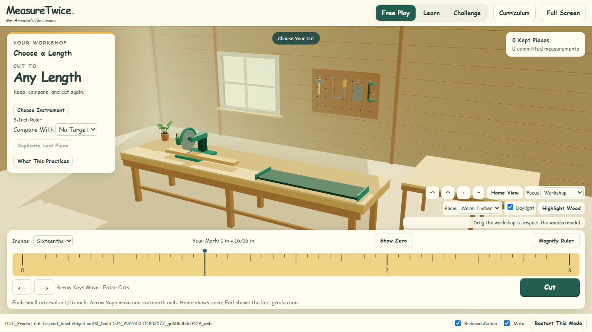
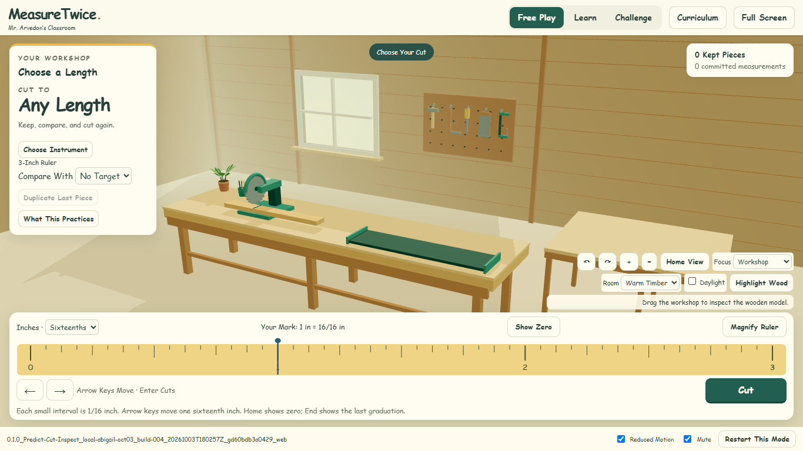
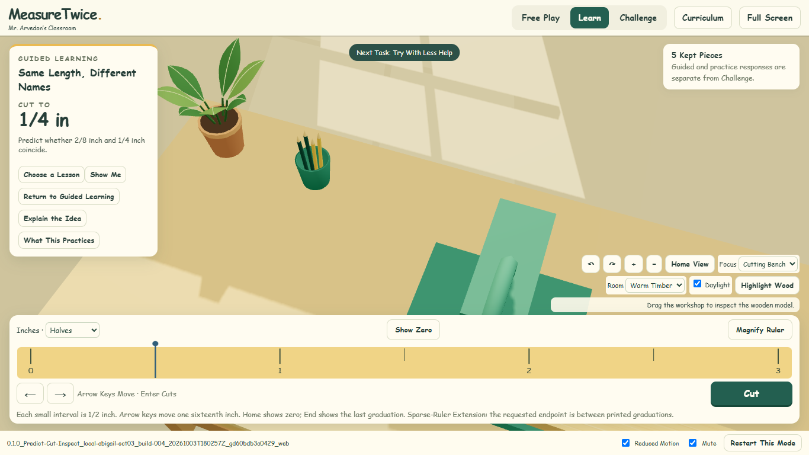
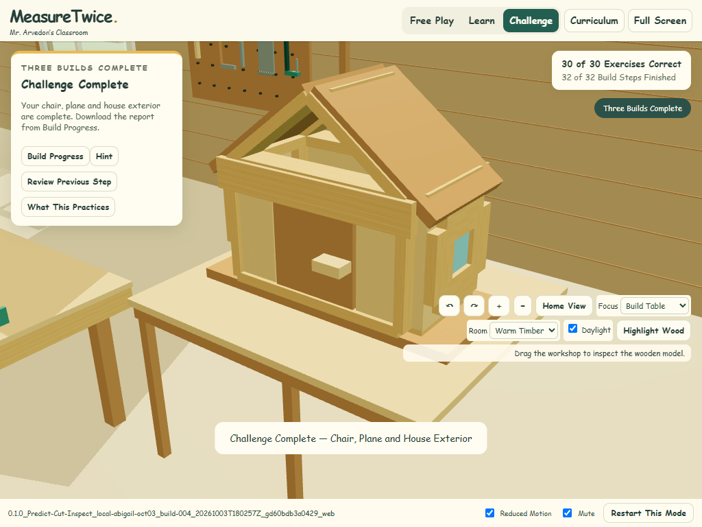
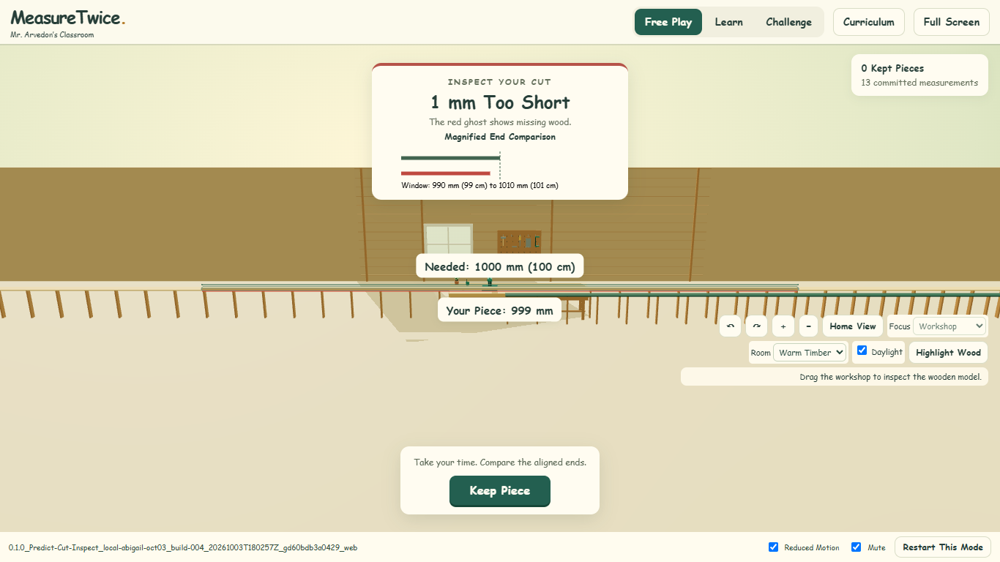

# Reconciled MeasureTwice Review

This isolated review preserves the [issue #1 house plan](https://github.com/AbbyUsesAIThatCodes/MeasureTwice/issues/1) and [issue #2 implementation foundation](https://github.com/AbbyUsesAIThatCodes/MeasureTwice/issues/2). It reconciles public hotfix #26 with unmerged draft work #20/#23/#24 and the approved #27–31 scope. The original 17-member house frame remains within the expanded construction sequence.

[Draft PR #32](https://github.com/AbbyUsesAIThatCodes/MeasureTwice/pull/32) · [Download The Tested Build](0.1.0_Predict-Cut-Inspect_local-abigail-oct03_build-004_20261003T180257Z_gd60bdb3a0429_web.zip) · [Question-By-Question Reconciliation](../../docs/CHALLENGE_RECONCILIATION.md)

## Exact Review Identity

| Field | Value |
| --- | --- |
| Build | `0.1.0_Predict-Cut-Inspect_local-abigail-oct03_build-004_20261003T180257Z_gd60bdb3a0429_web` |
| Version And Provisional Codename | `0.1.0` · Predict Cut Inspect |
| Built At | `2026-10-03T18:02:57.342Z` |
| Clean Source | `d60bdb3a04292584d28712df6f8d314514a7a708` |
| Review Branch | `review/measure-twice-reconciled` |
| Preserved Public Main | `ff5fec1144ca57448baad9f5205809bae15f0333` |
| ZIP SHA-256 | `4736fe735b14444f2d83553bc6161f86cebc15fe1ee6f304a0568f9e8635d652` |

The ordinal belongs to Abigail's local scope. Jess_PC remains the PR ordinal allocator, so this artifact has not been relabeled as a PR-scoped build. Later evidence-only commits do not change its source, build time or identity. [Embedded Manifest](build-manifest.json), [Build Report](BUILD_REPORT.json) and [Archive Verification](archive-verification.json) pin the exact artifact; all 51 archived files match the tested directory byte for byte.

On Abigail, the tested artifact is served at **http://127.0.0.1:18443** while the local server remains running. This address is local to that computer and is not a hosted public preview. To review elsewhere, download and extract the ZIP, enter its named folder, and run `Start Review.cmd` with Node installed, or run `node serve.mjs . 18443` and open that address. Three.js and its license are included; the application makes no external runtime requests. No deployment is part of this handoff.

## What To Review

- **Start At Zero:** graduations are lines; intervals are spaces. Changing the printed subdivisions updates the explanation. Six sixteenth-inch intervals equal three eighths, shown as three pairs. Half/quarter scales explicitly identify the sparse-ruler extension. EasyAsPie remains the prerequisite for equivalent-fraction work.
- **Preserved Instruction And Evidence:** all five freely accessible Learn lessons and their ten stages, all 30 Challenge IDs, 32 construction steps and 104 exact parts remain. Chair, plane and house progress automatically. Wrong cuts still cut, inspection waits for acknowledgement, retries preserve first responses, and both anonymous records and the completion report download.
- **Interaction Responses:** existing objective choices and committed cuts supply current evidence. No typed response is required. Legacy written-response definitions and records are preserved, but current interactions do not establish independently explained reasoning. The reconciliation table and full authored-content archive document each retained, revised and deferred responsibility.
- **Explicit Instruments In Free Play:** 3-, 6- and 12-inch rulers; a 36-inch yardstick; 15- and 30-centimetre rulers; and a 100-centimetre metre stick. One canonical tick is 1/80 mm. One sixteenth inch is exactly 127 ticks; 1 mm is 80 ticks. The yardstick is 73,152 ticks and the metre stick is 80,000 ticks. Selecting a workspace is explicit, clears kept comparison pieces, retains response history, and does not reinterpret an unfinished cut. Learn and Challenge retain their existing inch instrument.
- **Workshop Review Choices:** Warm Timber and Log Cabin, daylight on/off, varied mounted tools, the raised bench, pointed plant leaves, hollow cup with seated pencils, and a separate supported build table. The removed decorative saw grip remains absent. Cutting Bench and Build Table focus controls complement the Workshop view. Long instruments have explicit support extensions and a receiving stand.
- **Reusable Daylight:** [Window Daylight](../../docs/WINDOW_DAYLIGHT.md) documents the original editable consumer recipe, parameters, static floor-projection approximation and Sunny Woodshop provenance. [Asset Handoff](asset-handoff.json) pins source hashes. EdugamesGraphicsStorage #12's accepted shared archive is still pending visual acceptance.

## Verification Performed

| Evidence | Result |
| --- | --- |
| [Unit Tests](unit-tests.txt) | 33 passed, 0 failed; exact units, selection bands, response immutability, construction geometry and build identity. The separate original-house geometry check also passed: three families, 17 pieces and the 12–16–20 triangle. |
| [Sequential Challenge](sequential-verification.json) | 30 exercises, 32 steps and 104 parts; wrong-cut and reasoning retries, held inspection, completed-step redo, no duplicate awards, all three builds, actual completion-report download and restart history. 1,296 camera samples across 1920×1080, 1366×768 and 1024×768. |
| [Reconciled Features](reconciled-verification.json) | Five Learn lessons and ten stages; wrong-cut/choice retries; all printed subdivisions; six-sixteenths grouping; keyboard/pointer magnification; faded practice readout; seven exact presets; endpoint and adjacent incorrect cuts; mode return; duplicate lengths; actual anonymous JSON download. Another 1,008 camera samples include furniture and prop clearance. |
| [Access And Props](access-verification.json) | Unreduced targets before commitment, exposure and hint history, immutable independent responses, lesson access, demo cancellation, nested vocabulary, comparison gaps, bench height, seven leaves, hollow cup and seated pencil clearance. |
| [Motion Clearance](motion-clearance-verification.json) | 1,410 actual rendered geometry frames over eight short/long, minimum/maximum, full/skipped/reduced-motion cases. No tested stock/offcut/kept-piece intersections with the tray, bench, side table or retained stock lane. |
| [Build Focus](focus-review-verification.json) | Actual completed chair, plane and house views at 1366×768 and 1024×768; Home restores the workshop. Supplementary capture script included. |
| [Archive Verification](archive-verification.json) | ZIP identity and all 51 file hashes match the tested artifact; local served manifest matches the same build and source. |

Browser checks used desktop Chromium with SwiftShader, synthetic records, and the named immutable artifact; exact versions are in [Verification Environment](verification-environment.json). Main browser suites reported no page errors or external requests. Camera checks include 1920×1080; actual screenshots cover 1366×768, 1280×600 and 1024×768 layouts. The 1280×600 lesson panel scrolls while the ruler and Cut remain available. Automated sample counts are bounded checks, not proof of every possible geometric path. The smaller Workshop view can crop the side model; Build Table focus provides the complete model view.

## Actual Review Screenshots

### Six Sixteenths Make Three Eighths

### Warm Timber And Log Cabin

### Plant And Hollow Pencil Cup

### Completed House At Small Laptop Size

### Exact Metre Inspection

## Remaining Review Boundaries

Teacher acceptance of the visual direction, long-workspace proportions, instrument presets and revised evidence is pending. Metric assessment content remains deferred; these presets are Free Play choices. No physical Chromebook, lower-spec classroom device or classroom pilot was tested, and no performance or classroom-readiness claim is made. The shared graphics archive awaits acceptance. No main merge, public deployment, worksheet or other-game changes were made. Earlier draft PRs and historical artifacts remain intact.

All downloaded response files here are synthetic verification evidence, not student data.
